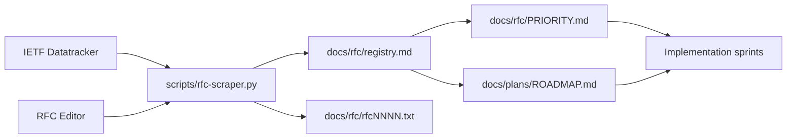

# iojournal Bootstrap And RFC Corpus

## Scope

- Establish the stable bootstrap documentation surface for Sprint 01.
- Define the canonical RFC harvesting inputs and outputs used by `scripts/rfc-scraper.py`.
- Fix the repository rule that stable docs must exist in both `docs/en` and `docs/ru`.

## Authoritative Inputs

| Source | Role | Local output |
| --- | --- | --- |
| IETF Datatracker | query RFC and Internet-Draft metadata | `docs/rfc/registry.md` |
| RFC Editor | canonical RFC text downloads | `docs/rfc/rfc*.txt` |
| `docs/plans/ROADMAP.md` | delivery scope to `v0.1.0-rc.1` | sprint sequencing |
| `docs/rfc/SOURCES.md` | curated source catalog | RFC navigation |
| `docs/rfc/PRIORITY.md` | MUST/SHOULD/MAY classification | implementation priorities |

## Artifact Set

- `scripts/rfc-scraper.py`: Python entry point for Datatracker queries and RFC text mirroring.
- `docs/rfc/registry.md`: generated registry of relevant RFCs and active drafts.
- `docs/rfc/SOURCES.md`: canonical external source list for the RFC corpus.
- `docs/rfc/PRIORITY.md`: priority map used by Sprint 01 and Sprint 02 planning.
- `docs/plans/2026-03-14-iojournal-v0.1.0-rc1-master-plan.md`: RFC to sprint mapping.

## Operational Rules

- Run RFC harvesting inside the Podman development image.
- Use `type__slug=rfc` and `type__slug=draft` for Datatracker document queries.
- Use `expires__gt=<UTC date>` for active draft filtering.
- Do not rely on Datatracker `order_by` for `doc/document` queries.
- Treat `docs/tmp/` as non-authoritative input material only.

## Flow

## Acceptance Conditions

- `docs/en/01-bootstrap-and-rfc-corpus.md` and `docs/ru/01-bootstrap-and-rfc-corpus.md` exist with matching filenames.
- `python3 -m unittest tests/unit/test_rfc_scraper.py` passes inside `localhost/iojournal-dev:latest`.
- `python3 scripts/rfc-scraper.py -o docs/rfc/registry.md` completes inside `localhost/iojournal-dev:latest`.
- `docs/rfc/registry.md`, `docs/rfc/SOURCES.md`, and `docs/rfc/PRIORITY.md` remain the canonical Sprint 01 RFC surface.
