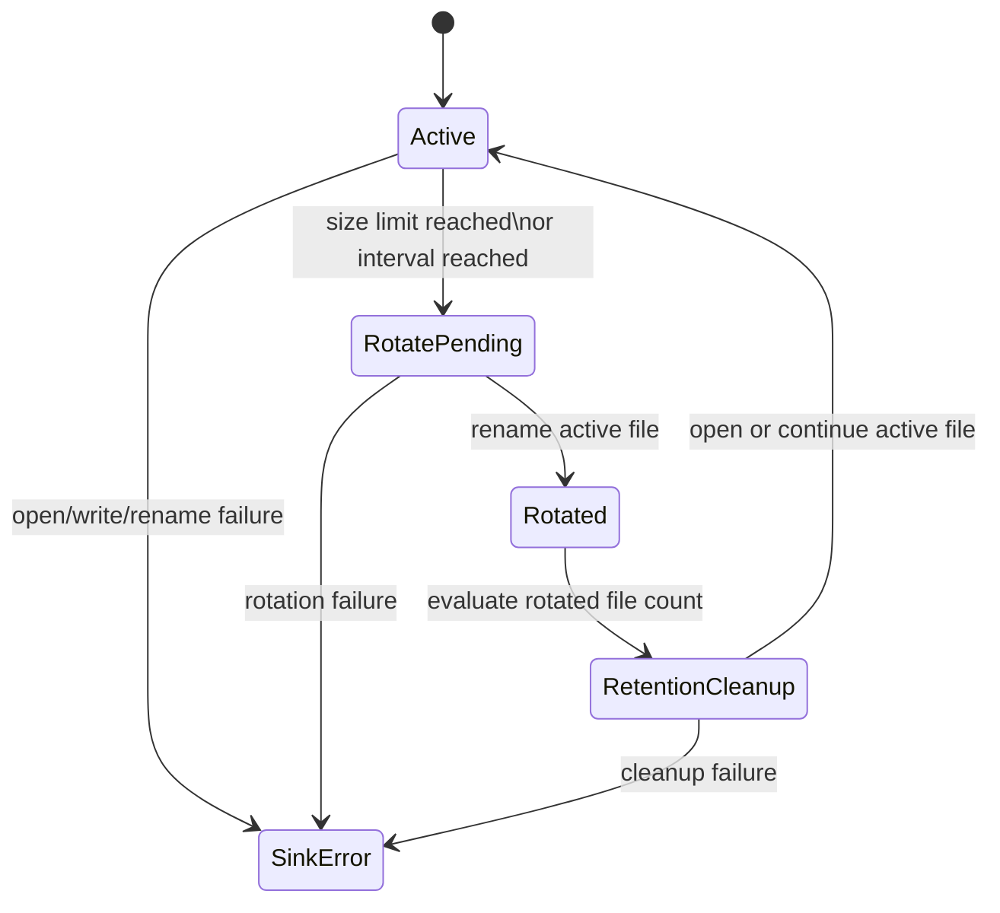

# iojournal RC File Sink

## Scope

- Define the RC local persistence contract for append-only NDJSON file output.
- Freeze the minimum rotation and retention behavior required by Sprint 06.
- Keep failure semantics explicit and bounded for `v0.1.0-rc.1`.

## Authoritative Dependencies

| Artifact | Role |
| --- | --- |
| `docs/rfc/JSON_NDJSON_CONTRACT.md` | canonical JSON and NDJSON record rules |
| `docs/rfc/TIMESTAMP_POLICY.md` | canonical timestamp serialization |
| `docs/rfc/REDACTION_POLICY.md` | required redaction behavior before file emission |
| `docs/api/RC_API_SURFACE.md` | sink-family boundary within `ij_logger_config_t` |
| `docs/plans/sprints/2026-03-14-sprint-06-file-sink-and-persistence.md` | Sprint 06 implementation scope |

## File Sink Mode

- The RC file sink writes one validated event per line.
- The active file is append-only.
- The file sink uses the same canonical event model as console JSON output.
- Redaction happens before NDJSON serialization.
- The file sink does not emit array wrappers, pretty-printing, or multi-line records.

## NDJSON Record Contract

| Rule | Requirement |
| --- | --- |
| Record shape | one RFC 8259 JSON object |
| Record delimiter | one trailing `LF` (`\n`) |
| Encoding | UTF-8 only |
| Top-level ordering | stable reserved-field order |
| Duplicate keys | forbidden |
| Partial line writes | forbidden |

## Stable Field Order

The RC file sink uses this top-level order:

1. `timestamp`
2. `level`
3. `event_name`
4. `message`
5. `logger` when present
6. `trace_id`, `span_id`, `trace_flags` when present
7. `source_file`, `source_line`, `source_function` when present
8. `attributes` when present

Attribute ordering must remain the validated native event order.

## Append Semantics

- The file sink must serialize one complete NDJSON line in memory before writing it.
- A line must be written as one contiguous payload plus one trailing `LF`.
- If serialization fails, the sink must not write any bytes for that event.
- If the target file does not exist, the sink may create it before the first append.
- The file sink must not truncate an existing active file during normal operation.

## Rotation Baseline

The RC baseline supports size and interval rotation.

| Trigger | Requirement |
| --- | --- |
| Size rotation | rotate before appending a record that would exceed the configured byte limit |
| Time rotation | rotate before appending the first record after the configured interval boundary |
| Trigger priority | if both triggers apply, rotate once before the append |
| Record integrity | one event must stay within one file; no record splitting across files |

Rotated files must:

- stay in the same directory as the active file
- use a deterministic UTC timestamp suffix
- preserve the `.ndjson` extension
- never overwrite an existing rotated file; a bounded sequence suffix is allowed on collision

## Retention Baseline

- Retention is count-based in the RC baseline.
- The sink keeps the newest rotated files up to the configured limit.
- Files beyond the configured retention limit are deleted only after a successful rotation.
- Retention cleanup must not delete the active file.
- Retention cleanup failures must not corrupt the active file or the freshly rotated file.

## Failure Semantics

| Failure class | Required behavior |
| --- | --- |
| open/create failure | return `IJ_STATUS_SINK_ERROR`; keep the event unpersisted |
| serialization failure | return `IJ_STATUS_ENCODE_ERROR`; write nothing |
| append failure | return `IJ_STATUS_SINK_ERROR`; do not emit a partial NDJSON line |
| rotation rename failure | return `IJ_STATUS_SINK_ERROR`; keep the pre-rotation active file intact |
| retention cleanup failure | keep new writes possible when the active file is healthy; expose sink failure status for the cleanup event |

Additional rules:

- The file sink must not recursively call the public logging API to report its own failure.
- A failed rotation must not silently discard already persisted data.
- The RC baseline does not promise crash-safe recovery beyond completed NDJSON lines already present on disk.

## Operational Limits

- Output records remain bound by the RC event limits from the API contract pack.
- The active file path is caller-provided configuration.
- Rotation and retention checks happen on the normal file sink path; they must remain bounded per event.
- Compression, archival upload, and background compaction are outside the RC scope.

## State View

## Non-Goals

- Compression of rotated files is not part of the RC.
- Byte-budget retention is not part of the RC.
- Cross-process file locking semantics are not part of the RC.
- WAL, journal replay, and crash-recovery reconstruction are not part of the RC.
- Remote upload of rotated files is not part of the RC.

## Acceptance Conditions

- Every completed line in the active or rotated files is independently parseable NDJSON.
- Stable field order matches the canonical RC event ordering.
- Rotation never splits one event across two files.
- Retention never deletes the active file.
- File sink failures surface through `ij_status_t` without recursive logging.
