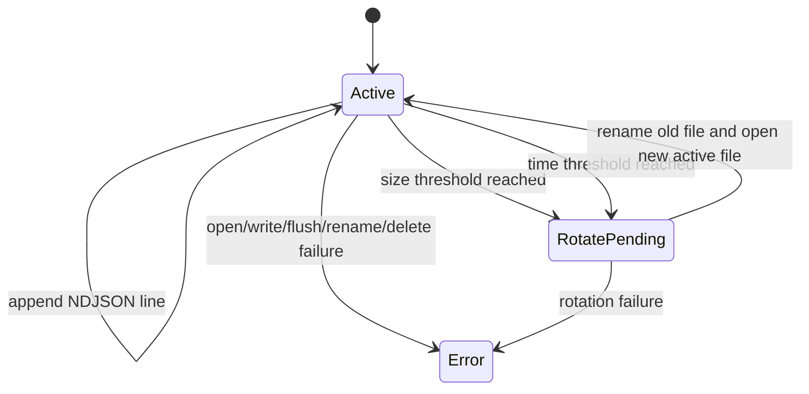

# RC File Sink

## Scope

- define the RC file sink contract for local NDJSON persistence
- freeze append-only output rules, rotation baseline, retention baseline, and failure semantics
- keep the file sink bounded and sink-specific without widening the public logger API

## Output Contract

| Item | Requirement |
| --- | --- |
| record format | one valid RFC 8259 JSON object per line |
| line separator | `LF` only |
| encoding | UTF-8 only |
| file mode | append-only |
| field order | same reserved field order as the console JSON encoder |
| redaction | identical to the console sink for the same event payload |

## Required Behavior

- the file sink must write one complete NDJSON line per accepted event
- partial line writes are forbidden as a successful outcome
- newline characters inside `message` or attribute values must remain JSON-escaped inside the record body
- `ij_logger_flush` must flush the active file stream for the file sink
- file sink failures must surface through the common status model

## Rotation Baseline

The RC rotation baseline supports:

- size-triggered rotation when the next record would exceed the configured byte threshold
- time-triggered rotation when the configured interval has elapsed before the next write
- deterministic rotated filenames in the same directory as the active file

The active file remains writable after rotation. Rotation creates a new active file and moves the previous active file to a rotated path.

## Retention Baseline

- retention is count-based in the RC
- the configured retention count limits rotated files, not the active file
- when the rotated-file count exceeds the configured bound, the oldest rotated files must be deleted first
- retention work must happen in the file sink path; no external janitor is required for the RC contract

## Failure Semantics

| Failure class | Required outcome |
| --- | --- |
| file open failure | `ij_logger_init` fails |
| write failure | `ij_logger_log` returns `IJ_STATUS_SINK_ERROR` |
| flush failure | `ij_logger_flush` returns `IJ_STATUS_SINK_ERROR` |
| rotate or rename failure | the current call fails with `IJ_STATUS_SINK_ERROR` |
| retention deletion failure | the current call fails with `IJ_STATUS_SINK_ERROR` or keeps stricter retention state; silent success is forbidden |

## Operational Limits

- the file sink does not provide crash-safe recovery in the RC
- retention is local to one process instance
- the RC contract does not require file locking for multi-process writers
- the RC contract does not require compression or archival

## State Model

## Non-Goals

- no crash-consistent journal replay
- no compression of rotated files
- no encryption at rest
- no multi-process coordination protocol
- no pretty-printed JSON output
