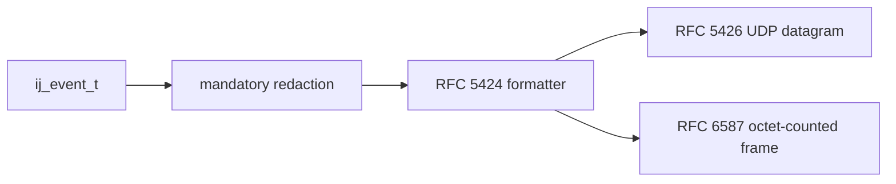

# Syslog Contract

## Scope

This document freezes the stable Sprint 07 RC syslog surface for:

- RFC 5424 message formatting
- RFC 5426 UDP delivery
- RFC 6587 TCP octet-counting delivery

Excluded from this document:

- RFC 5425 syslog over TLS
- RFC 3164 output mode
- RFC 6587 delimiter-based framing
- automatic projection of JSON attributes into RFC 5424 structured data

## Delivery Path

## Formatter Rules

| Field | RC rule |
|---|---|
| `PRI` | `facility * 8 + severity` |
| `VERSION` | fixed `1` |
| `TIMESTAMP` | RFC 3339 UTC with millisecond precision |
| `HOSTNAME` | `-` |
| `APP-NAME` | `event.logger`, else `config.logger_name`, else `-` |
| `PROCID` | `-` |
| `MSGID` | `-` |
| `STRUCTURED-DATA` | `-` |
| `MSG` | UTF-8 event message |

Native RC level mapping:

| `ij_level_t` | RFC 5424 severity |
|---|---|
| `IJ_LEVEL_FATAL` | `2` |
| `IJ_LEVEL_ERROR` | `3` |
| `IJ_LEVEL_WARN` | `4` |
| `IJ_LEVEL_INFO` | `6` |
| `IJ_LEVEL_DEBUG` | `7` |
| `IJ_LEVEL_TRACE` | `7` |

## Transport Rules

| Transport | RC behavior |
|---|---|
| UDP | one RFC 5424 message per datagram |
| UDP limit | payloads above `IJ_SYSLOG_UDP_TARGET_MAX` are rejected; they are not fragmented |
| TCP | octet-counting only: `MSG-LEN SP SYSLOG-MSG` |
| Flush | bounded no-op for the current synchronous sink path |

## Verification Evidence

- `tests/unit/test_rfc5424.c` validates canonical RFC 5424 output against golden fixtures.
- `tests/unit/test_syslog_udp.c` validates one-message-per-datagram UDP delivery.
- `tests/unit/test_syslog_tcp.c` validates RFC 6587 octet-counted framing.
- `examples/syslog_udp.c` and `examples/syslog_tcp.c` provide runnable RC evidence in the containerized quality gate.
