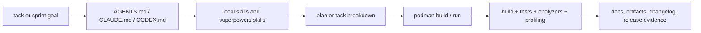

# Tooling And Agent Workflow

## Scope

This document defines the stable development workflow for `iojournal`:

- mandatory container execution model
- Clang 22 analysis and debug tooling baseline
- performance and profiling toolchain baseline
- benchmark methodology and profiler workflow entrypoints
- repository-local skill usage
- role boundaries between `AGENTS.md`, `CLAUDE.md`, `CODEX.md`, and local skills

This document is authoritative for workflow and tooling expectations. It does not replace
feature-specific plans under `docs/plans/`.

## Execution Model

- Develop and verify inside the Podman image from `deploy/podman/Containerfile`.
- Treat the container as the primary build, analysis, benchmark, and release environment.
- Treat host tools as orchestration helpers only.
- Keep benchmark and profiling procedures reproducible from repository scripts or documented commands.
- Keep the default Podman launch for normal build, test, and analyzer work.
- Use `scripts/podman_perf_lane.py` as the official Podman launch mode for `io_uring`,
  `uftrace`, `gdb`, and other ptrace-sensitive performance lanes.

## Mandatory Build And Analysis Baseline

| Area | Required baseline |
|---|---|
| Container runtime | `podman` |
| Build system | `cmake`, `ctest`, `CMakePresets.json` |
| Formatting | `clang-format` |
| Static analysis | `cppcheck`, `PVS-Studio`, `CodeChecker` |
| Clang analysis | `clang-tidy`, `clang` Static Analyzer |
| Documentation validation | `python3 scripts/lint-docs.py` |
| Benchmark harness | `bash scripts/run-benchmarks.sh` |
| Profiler entrypoint | `bash scripts/run-profiler-review.sh` |
| Podman perf lane | `uv run --script scripts/podman_perf_lane.py ...` |
| uftrace profiler build lane | `bash scripts/build-uftrace-bench.sh` |
| Repository gate | `python scripts/quality.py` |

## Clang 22 Tooling Baseline

The repository should use the following Clang 22 tools or features as part of the hardening and
performance program.

| Tool or feature | Purpose | Expected use |
|---|---|---|
| `clang-tidy` | lint and rule-based analysis | mandatory through `CodeChecker` and standalone targeted runs |
| `run-clang-tidy.py` | batch `clang-tidy` execution from `compile_commands.json` | use for large local sweeps and benchmark harness code |
| `clang-tidy-diff.py` | diff-only `clang-tidy` review | use for focused review of incremental patches |
| `clang` Static Analyzer | path-sensitive bug finding | mandatory through `CodeChecker`; optionally through `scan-build` |
| `scan-build` | local analyzer wrapper over builds | use for HTML triage and ad hoc local analysis |
| `scan-view` | browser inspection of `scan-build` reports | use when local HTML triage is needed |
| `clang-check` | fast translation-unit sanity checks | use for targeted parser/front-end inspection of one TU |
| `diagtool` | diagnostic group discovery and warning policy inspection | use when tightening warning policy or mapping diagnostics |
| `-ftime-trace` | compile and analysis time tracing | mandatory option for compiler-time and analyzer-time investigations |
| `-fproc-stat-report` | process time and memory reporting | use for measurement of analysis/build cost in methodology docs |
| source-based coverage | precise Clang coverage artifacts | use for verification and release evidence where coverage is required |

## GCC 15 Tooling Baseline

The repository should also carry a GCC analysis and profiling lane for cross-tool validation.

| Tool or feature | Purpose | Expected use |
|---|---|---|
| `-fanalyzer` | GCC path-sensitive static analysis | run as a distinct analysis lane next to Clang tools |
| `-fanalyzer-checker=` | targeted GCC analyzer checkers | use for focused triage and reduced-noise repro runs |
| `-Wanalyzer-too-complex` | analyzer complexity visibility | keep enabled to detect lost analyzer coverage |
| `--param analyzer-*` | analyzer tuning | use for large translation units and benchmark harness work |
| `gcov` | GCC coverage collection | use as the raw coverage producer for GCC lanes |
| `gcovr` | coverage report generation and CI-friendly export | use for HTML, SonarQube, Cobertura, and summary outputs |
| `gcov-tool` | offline profile and coverage data processing | use for merge and normalization workflows |
| `gcov-dump` | low-level inspection of `.gcda` / `.gcno` data | use for debugging broken coverage or profile artifacts |
| `lto-dump` | inspection of LTO objects | use when LTO or optimizer evidence is part of perf review |
| `-fprofile-generate` / `-fprofile-use` | PGO experiments | use for capability studies and post-baseline optimization work |
| `-Q --help=optimizers` | effective optimizer set inspection | use for reproducible methodology capture |
| `-fprofile-report` | profile diagnostics | use when documenting profile-use behavior |

Rules:

- Do not replace the Clang lane with the GCC lane.
- Treat GCC tooling as a second evidence source for correctness, coverage, and optimization review.
- Keep `gcovr` as the preferred coverage reporting layer when the GCC lane is used.

## Compiler Interoperability And Vectorization Rules

- Keep both Clang and GCC lanes active for compiler-sensitive `iojournal` work. Published and
  measured lanes must use explicit `-std=c23`; GCC's default `gnu23` mode is not the repository
  contract.
- Do not mix GCC and Clang sanitizer objects, LTO objects, or function-multi-versioned resolvers
  in one binary, one benchmark artifact set, or one release verification pack.
- For hot-path loop, SIMD, or dispatch-sensitive changes, capture vectorization diagnostics from
  both compilers:
  - Clang: `-Rpass=loop-vectorize -Rpass-missed=loop-vectorize -Rpass-analysis=loop-vectorize`
  - GCC: `-fopt-info-vec-all`
- Prefer `#pragma omp simd` as the portable vectorization hint. Keep compiler-specific pragmas
  inside internal kernels only, with scalar fallback and measured justification.
- Add `restrict` only when the non-aliasing contract is explicit in the API or internal ownership
  rules and is covered by tests or invariants.
- Keep `-ffast-math` disabled for repository baselines. If a measured kernel needs local FP
  contraction, scope it narrowly and record the reason in the evidence docs.
- When reopening `arm64` SIMD work, keep a Clang lane in scope because `NEON` and future SVE-family
  codegen quality is not expected to match GCC one-to-one.

## Performance And Debug Toolchain

These tools are part of the expected stack for performance review and benchmark investigation.

| Tool | Purpose |
|---|---|
| `hyperfine` | repeatable command-level timing and comparison |
| `uftrace` | hot-path tracing and function-cost inspection |
| `valgrind --tool=callgrind` | call-cost and instruction-path review |
| `gdb` | low-level debugging and crash investigation |
| `gcovr` | coverage reporting for benchmark and verification lanes |
| `clang-perf` preset | release-facing local benchmark and callgrind baseline |
| `clang-uftrace` preset | `-pg`-instrumented lane for `uftrace` and profiler parity |
| `clang-asan` / `clang-tsan` presets | safety and concurrency support evidence |
| `gcc -fanalyzer` lane | cross-tool static analysis evidence |

Rules:

- Do not treat profiler output as a substitute for correctness checks.
- Do not publish performance claims without methodology and raw artifacts.
- Do not compare libraries on non-normalized scenarios without marking them capability-specific.

## Benchmark And Profiler Entry Points

Use these documents and scripts as the stable surface for the Sprint 09 and Sprint 10 evidence pack:

| Surface | Role |
|---|---|
| `docs/testing/BENCHMARK_METHODOLOGY.md` | normalized scenario catalog, artifact policy, and comparison rules |
| `docs/testing/PROFILER_WORKFLOW.md` | profiler tool selection, artifact policy, and review rules |
| `scripts/podman_perf_lane.py` | official Podman launch mode for `io_uring` and ptrace-sensitive profiler work |
| `scripts/run-benchmarks.sh` | build and execute the repository benchmark binaries and emit raw TSV artifacts |
| `scripts/build-uftrace-bench.sh` | build the dedicated `clang-uftrace` benchmark binaries |
| `scripts/run-profiler-review.sh` | run one profiler mode against one benchmark binary and scenario |

Rules:

- Treat `docs/testing/BENCHMARK_METHODOLOGY.md` as the authority for scenario IDs and shared versus capability-specific boundaries.
- Treat `docs/testing/PROFILER_WORKFLOW.md` as the authority for profiler-backed evidence requirements.
- Keep repository scripts aligned with both documents when benchmark or profiler modes change.
- Use `clang-perf` for release-facing local comparisons and `clang-uftrace` for `uftrace` evidence.
- Use `scripts/podman_perf_lane.py` when the benchmark or profiler task depends on `io_uring`
  availability or relaxed ptrace restrictions; do not broaden the default Podman lane.

## Skills And Agents

### Repository-local skills

Local skills under `.claude/skills/` are project memory for repeated decisions:

- `iojournal-architecture`
- `iojournal-coding-standards`
- `iojournal-repository-conventions`
- `logging-rfc-reference`
- `modern-c23`

Rules:

- Use repository-local skills before inventing new architectural or style guidance.
- Treat the skill content as a reusable decision cache, not as optional hints.
- Keep the local skills aligned with the stable docs and root instruction files.

### Superpowers and workflow skills

Use the matching workflow skill when the task requires it:

- brainstorming before new feature or workflow design
- writing-plans when expanding multi-step work
- test-driven-development before implementation
- subagent-driven-development when tasks can be split safely
- verification-before-completion before claiming success

### Agents

Agents are execution helpers, not policy sources.

Rules:

- Subagents may explore, implement, review, or summarize isolated tasks.
- Subagents must follow the same repository rules as the main agent.
- Policy still comes from `AGENTS.md`, `CLAUDE.md`, `CODEX.md`, stable docs, and local skills.
- Agent output is evidence only after the main agent reviews and integrates it.

## Root Instruction Roles

| File | Role |
|---|---|
| `AGENTS.md` | repository-wide operational contract for structure, tooling, docs style, testing, and workflow |
| `CLAUDE.md` | Claude-specific project instructions and emphasis areas |
| `CODEX.md` | Codex-specific project instructions and working rules |
| `.claude/skills/*` | reusable local decision memory and workflows |

Interpretation rules:

- `AGENTS.md` defines the common repository policy surface.
- `CLAUDE.md` and `CODEX.md` refine agent-specific behavior without overriding repository facts.
- Stable docs under `docs/en/` win over scratch notes under `docs/tmp/`.
- Plans under `docs/plans/` define delivery sequencing, not repository-wide coding policy.

## Operational Rules

- Keep `AGENTS.md`, `CLAUDE.md`, `CODEX.md`, and local skills synchronized when workflow rules change.
- Add new tools to the container image before making them mandatory in plans.
- Record externally visible tooling changes in `CHANGELOG.md`.
- Keep benchmark, analyzer, and profiler procedures runnable from the repository root.

## Non-Goals

- No host-only verification workflow.
- No undocumented profiler-only claims in release materials.
- No independent skill or agent policy that contradicts the root repository instructions.
