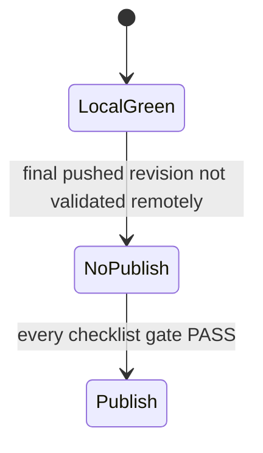

# RC1 Publish Decision

## Decision

| Field | Value |
| --- | --- |
| Target | `v0.1.0-rc.1` |
| Decision | `NO-PUBLISH` |
| Decision date | `2026-03-17` |
| Decision basis | Sprint 11D is complete and all local gates are green, but the final remote gate is still unresolved |

## Current Evidence

| Gate | Current Evidence | Status |
| --- | --- | --- |
| Local quality | `python3 scripts/lint-docs.py` `PASS`; `python scripts/quality.py` `PASS: 14`, `FAIL: 0`, `SKIP: 0` | `PASS` |
| Functional comparison | Sprint 10 pack complete under [`docs/plans/comparison/`](/opt/projects/repositories/iojournal/docs/plans/comparison/) | `PASS` |
| Optimization evidence | active benchmark [`20260316-210134`](/opt/projects/repositories/iojournal/docs/tmp/benchmarks/20260316-210134), active profiler pack [`20260316-210204`](/opt/projects/repositories/iojournal/docs/tmp/profiling/20260316-210204), active `uftrace` companions [`20260316-210329`](/opt/projects/repositories/iojournal/docs/tmp/profiling/20260316-210329), [`20260316-210345`](/opt/projects/repositories/iojournal/docs/tmp/profiling/20260316-210345), [`20260316-210349`](/opt/projects/repositories/iojournal/docs/tmp/profiling/20260316-210349) | `PASS` |
| Release candidate run | active local RC run [`20260316T212052Z-d52d88e`](/opt/projects/repositories/iojournal/dist/release-candidate/runs/20260316T212052Z-d52d88e/summary.md) from the post-11D workspace state | `PASS` |
| Release assets | `dist/iojournal-v0.1.0-rc.1.tar.gz`, `dist/iojournal-v0.1.0-rc.1-verification.tar.gz`, `dist/iojournal-v0.1.0-rc.1.sha256`, and `dist/RELEASE_NOTES.md` exist for the post-11D workspace state | `PASS` |
| Repository ownership | [`.github/CODEOWNERS`](/opt/projects/repositories/iojournal/.github/CODEOWNERS) now assigns the repository to `@ioplane/developers` | `PASS` |
| Structural optimization gate | Sprint 11D is complete; optimization evidence refreshed | `PASS` |
| Final remote gate | final workspace state has not been committed and pushed yet; current GitHub runs do not represent the final local state | `FAIL` |

## Current Remote Signal

- The last visible GitHub Actions runs are still tied to commit `d52d88e`.
- Those runs are not authoritative for the current local workspace state.
- The current local release-candidate run and release assets were generated before Sprint 11D landed, so they must be regenerated from the final post-11D workspace state.
- The visible remote history already shows non-green runs for `Release Gate`, `codeql`, and `sonarcloud`, so remote publication must not proceed without a fresh pushed revision and a new workflow pass.

## Required Actions Before Publish

1. Re-run `uv run --script scripts/release_candidate.py` and refresh `dist/release-candidate` from the final post-11D state.
2. Re-run `uv run --script scripts/release_assets.py v0.1.0-rc.1` and `uv run --script scripts/release_notes.py v0.1.0-rc.1`.
3. Commit and push the final workspace state.
4. Wait for the required GitHub workflow runs on the pushed revision and record their outcome.
5. Update this document to `PUBLISH` only after every gate in [`05-release-candidate-checklist.md`](/opt/projects/repositories/iojournal/docs/en/05-release-candidate-checklist.md) is `PASS`.
