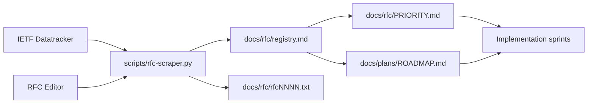

# iojournal Bootstrap And RFC Corpus

## Назначение

- Зафиксировать стабильную bootstrap-документацию для Sprint 01.
- Определить канонические входы и выходы RFC harvesting, которые использует `scripts/rfc-scraper.py`.
- Закрыть требование репозитория о наличии стабильных numbered docs одновременно в `docs/en` и `docs/ru`.

## Авторитетные источники

| Источник | Роль | Локальный результат |
| --- | --- | --- |
| IETF Datatracker | запрос метаданных RFC и Internet-Draft | `docs/rfc/registry.md` |
| RFC Editor | канонические текстовые RFC | `docs/rfc/rfc*.txt` |
| `docs/plans/ROADMAP.md` | границы поставки до `v0.1.0-rc.1` | последовательность спринтов |
| `docs/rfc/SOURCES.md` | curated source catalog | навигация по RFC |
| `docs/rfc/PRIORITY.md` | классификация MUST/SHOULD/MAY | приоритеты реализации |

## Набор артефактов

- `scripts/rfc-scraper.py`: Python entry point для запросов к Datatracker и зеркалирования RFC text.
- `docs/rfc/registry.md`: сгенерированный реестр релевантных RFC и active drafts.
- `docs/rfc/SOURCES.md`: канонический список внешних источников для RFC corpus.
- `docs/rfc/PRIORITY.md`: priority map, используемый в Sprint 01 и Sprint 02.
- `docs/plans/2026-03-14-iojournal-v0.1.0-rc1-master-plan.md`: отображение RFC на спринты.

## Операционные правила

- Запускайте RFC harvesting внутри Podman development image.
- Для запросов Datatracker используйте `type__slug=rfc` и `type__slug=draft`.
- Для фильтрации active drafts используйте `expires__gt=<UTC date>`.
- Не полагайтесь на `order_by` в запросах Datatracker `doc/document`.
- Каталог `docs/tmp/` остается неавторитетным входным материалом.

## Поток

## Условия приемки

- `docs/en/01-bootstrap-and-rfc-corpus.md` и `docs/ru/01-bootstrap-and-rfc-corpus.md` существуют с одинаковыми именами файлов.
- `python3 -m unittest tests/unit/test_rfc_scraper.py` проходит внутри `localhost/iojournal-dev:latest`.
- `python3 scripts/rfc-scraper.py -o docs/rfc/registry.md` успешно завершается внутри `localhost/iojournal-dev:latest`.
- `docs/rfc/registry.md`, `docs/rfc/SOURCES.md` и `docs/rfc/PRIORITY.md` остаются канонической RFC-поверхностью Sprint 01.
