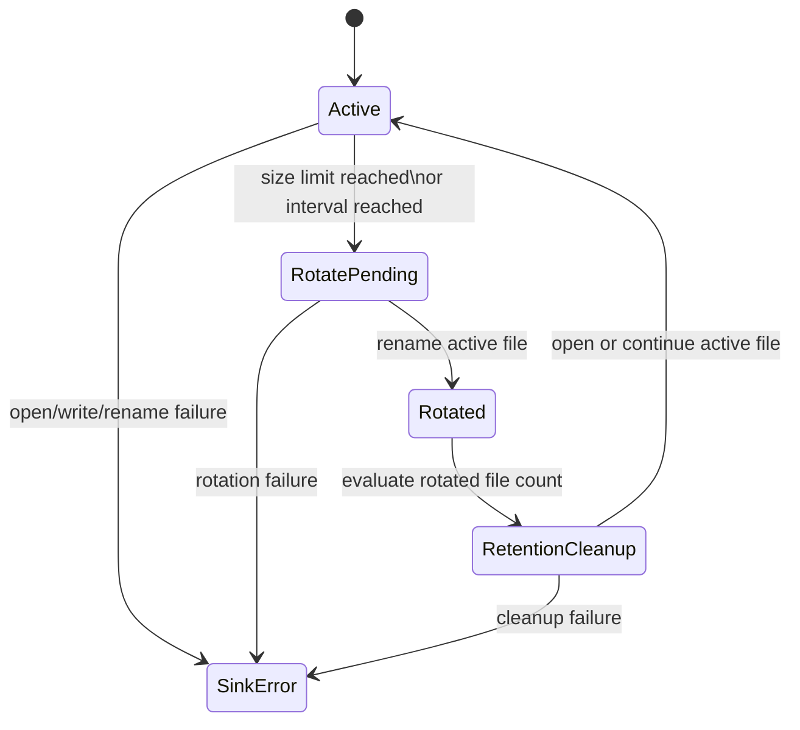

# iojournal RC File Sink

## Назначение

- Определить RC-контракт локальной персистентности для append-only NDJSON file output.
- Зафиксировать минимальное поведение rotation и retention, требуемое Sprint 06.
- Оставить failure semantics явными и bounded для `v0.1.0-rc.1`.

## Авторитетные зависимости

| Артефакт | Роль |
| --- | --- |
| `docs/rfc/JSON_NDJSON_CONTRACT.md` | канонические правила JSON и NDJSON record |
| `docs/rfc/TIMESTAMP_POLICY.md` | каноническая сериализация timestamp |
| `docs/rfc/REDACTION_POLICY.md` | обязательное redaction behavior до file emission |
| `docs/api/RC_API_SURFACE.md` | границы sink family внутри `ij_logger_config_t` |
| `docs/plans/sprints/2026-03-14-sprint-06-file-sink-and-persistence.md` | границы реализации Sprint 06 |

## Режим file sink

- RC file sink пишет один validated event в одну строку.
- Активный файл работает в append-only режиме.
- File sink использует ту же каноническую event model, что и console JSON output.
- Redaction выполняется до NDJSON serialization.
- File sink не выводит array wrapper, pretty-printing и multi-line records.

## Контракт NDJSON record

| Правило | Требование |
| --- | --- |
| Форма record | один RFC 8259 JSON object |
| Разделитель record | один завершающий `LF` (`\n`) |
| Encoding | только UTF-8 |
| Порядок top-level полей | стабильный reserved-field order |
| Duplicate keys | запрещены |
| Partial line writes | запрещены |

## Стабильный порядок полей

RC file sink использует такой top-level порядок:

1. `timestamp`
2. `level`
3. `event_name`
4. `message`
5. `logger`, если поле присутствует
6. `trace_id`, `span_id`, `trace_flags`, если поля присутствуют
7. `source_file`, `source_line`, `source_function`, если поля присутствуют
8. `attributes`, если поле присутствует

Порядок `attributes` обязан сохранять validated native event order.

## Append semantics

- File sink обязан полностью сериализовать одну NDJSON line в памяти до записи.
- Строка должна записываться как один непрерывный payload плюс один завершающий `LF`.
- Если serialization завершилась ошибкой, sink не должен писать ни одного байта этого event.
- Если target file отсутствует, sink может создать его перед первым append.
- В нормальном режиме работы file sink не должен truncate существующий active file.

## Rotation baseline

RC baseline поддерживает rotation по размеру и по интервалу.

| Триггер | Требование |
| --- | --- |
| Size rotation | rotation выполняется до append record, который превысил бы configured byte limit |
| Time rotation | rotation выполняется до append первого record после configured interval boundary |
| Приоритет триггеров | если срабатывают оба триггера, выполняется одна rotation до append |
| Целостность record | один event обязан остаться в пределах одного файла; splitting между файлами запрещен |

Rotated files обязаны:

- оставаться в той же директории, что и active file
- использовать детерминированный UTC timestamp suffix
- сохранять расширение `.ndjson`
- не перезаписывать существующий rotated file; при коллизии допускается bounded sequence suffix

## Retention baseline

- Retention в RC baseline основан на количестве файлов.
- Sink хранит новые rotated files в пределах configured limit.
- Файлы сверх configured retention limit удаляются только после успешной rotation.
- Retention cleanup не должен удалять active file.
- Ошибки retention cleanup не должны повреждать active file или freshly rotated file.

## Failure semantics

| Класс отказа | Обязательное поведение |
| --- | --- |
| open/create failure | вернуть `IJ_STATUS_SINK_ERROR`; event остается неперсистированным |
| serialization failure | вернуть `IJ_STATUS_ENCODE_ERROR`; ничего не писать |
| append failure | вернуть `IJ_STATUS_SINK_ERROR`; не выпускать partial NDJSON line |
| rotation rename failure | вернуть `IJ_STATUS_SINK_ERROR`; pre-rotation active file остается целым |
| retention cleanup failure | сохранять возможность новых writes, если active file healthy; поднимать sink failure status для cleanup event |

Дополнительные правила:

- File sink не должен рекурсивно вызывать public logging API для сообщения о собственной ошибке.
- Неуспешная rotation не должна молча отбрасывать уже persist-данные.
- RC baseline не обещает crash-safe recovery сверх completed NDJSON lines, уже записанных на диск.

## Операционные ограничения

- Output records остаются ограниченными RC event limits из API contract pack.
- Путь active file задается caller-provided configuration.
- Проверки rotation и retention выполняются на normal file sink path и обязаны оставаться bounded на один event.
- Compression, archival upload и background compaction находятся вне RC scope.

## Представление состояний

## Non-Goals

- Compression rotated files не входит в RC.
- Retention по byte budget не входит в RC.
- Cross-process file locking semantics не входят в RC.
- WAL, journal replay и crash-recovery reconstruction не входят в RC.
- Remote upload rotated files не входит в RC.

## Условия приемки

- Каждая завершенная строка в active или rotated files независимо разбирается как NDJSON.
- Стабильный порядок полей соответствует каноническому RC event ordering.
- Rotation никогда не делит один event между двумя файлами.
- Retention никогда не удаляет active file.
- Ошибки file sink выходят через `ij_status_t` без recursive logging.
