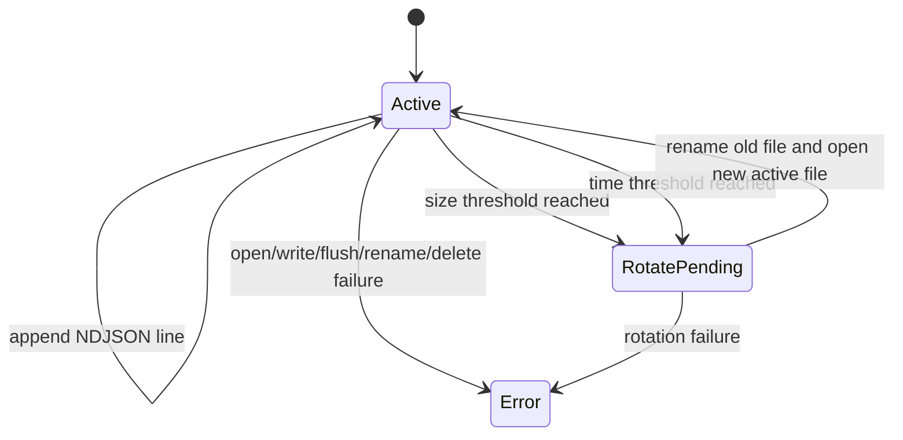

# Файловый Приемник RC

## Назначение

- зафиксировать контракт файлового приемника RC для локальной NDJSON-персистентности
- зафиксировать правила append-only вывода, базовый rotation, базовый retention и семантику ошибок
- сохранить файловый приемник ограниченным по ответственности и не расширять публичный logger API

## Контракт Вывода

| Пункт | Требование |
| --- | --- |
| формат записи | один корректный RFC 8259 JSON object на строку |
| разделитель строк | только `LF` |
| кодировка | только UTF-8 |
| режим файла | append-only |
| порядок полей | тот же порядок зарезервированных полей, что и у console JSON encoder |
| redaction | идентичен console sink для того же event payload |

## Обязательное Поведение

- файловый приемник должен записывать одну завершенную NDJSON-строку на каждое принятое событие
- частичная запись строки не может считаться успешным исходом
- символы перевода строки внутри `message` и значений атрибутов должны оставаться JSON-экранированными внутри тела записи
- `ij_logger_flush` должен сбрасывать активный файловый поток для файлового приемника
- ошибки файлового приемника должны подниматься через общую модель статусов

## Базовый Rotation

В RC базовый rotation поддерживает:

- rotation по размеру, когда следующая запись превысит настроенный порог в байтах
- rotation по времени, когда до следующей записи истек настроенный интервал
- детерминированные имена rotated-файлов в том же каталоге, что и активный файл

После rotation активный файл должен снова быть доступен для записи. Rotation переносит предыдущий активный файл в rotated-path и открывает новый активный файл.

## Базовый Retention

- в RC retention задается количеством файлов
- ограничение распространяется на rotated-файлы, но не на активный файл
- при превышении настроенного лимита сначала удаляются самые старые rotated-файлы
- работа retention должна выполняться внутри file sink path; внешний janitor для контракта RC не требуется

## Семантика Ошибок

| Класс ошибки | Обязательный результат |
| --- | --- |
| ошибка открытия файла | `ij_logger_init` завершается неуспешно |
| ошибка записи | `ij_logger_log` возвращает `IJ_STATUS_SINK_ERROR` |
| ошибка flush | `ij_logger_flush` возвращает `IJ_STATUS_SINK_ERROR` |
| ошибка rotate или rename | текущий вызов завершается с `IJ_STATUS_SINK_ERROR` |
| ошибка удаления по retention | текущий вызов завершается с `IJ_STATUS_SINK_ERROR` или сохраняет более строгую retention-семантику; молчаливый успех запрещен |

## Эксплуатационные Ограничения

- контракт RC не задает crash-safe recovery
- retention локален для одного процесса
- контракт RC не требует file locking для multi-process writers
- контракт RC не требует compression или archival

## Модель Состояний

## Не Входит В RC

- crash-consistent journal replay
- compression rotated-файлов
- encryption at rest
- протокол координации для нескольких процессов
- pretty-printed JSON output
