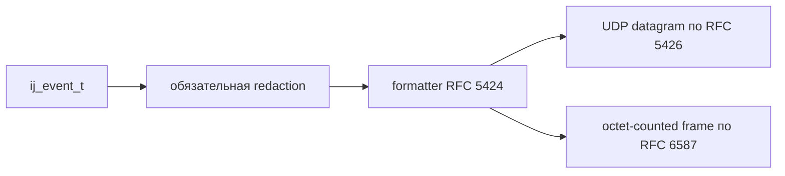

# Контракт syslog

## Область действия

Этот документ фиксирует стабильную поверхность Sprint 07 для первого RC:

- форматирование сообщений по RFC 5424
- доставка по UDP согласно RFC 5426
- доставка по TCP с octet-counting согласно RFC 6587

Из документа исключены:

- RFC 5425 syslog over TLS
- режим вывода RFC 3164
- delimiter-based framing из RFC 6587
- автоматическая проекция JSON attributes в RFC 5424 structured data

## Путь доставки

## Правила formatter

| Поле | Правило RC |
|---|---|
| `PRI` | `facility * 8 + severity` |
| `VERSION` | фиксированное значение `1` |
| `TIMESTAMP` | RFC 3339 UTC с миллисекундной точностью |
| `HOSTNAME` | `-` |
| `APP-NAME` | `event.logger`, иначе `config.logger_name`, иначе `-` |
| `PROCID` | `-` |
| `MSGID` | `-` |
| `STRUCTURED-DATA` | `-` |
| `MSG` | UTF-8 сообщение события |

Отображение уровней `ij_level_t`:

| `ij_level_t` | RFC 5424 severity |
|---|---|
| `IJ_LEVEL_FATAL` | `2` |
| `IJ_LEVEL_ERROR` | `3` |
| `IJ_LEVEL_WARN` | `4` |
| `IJ_LEVEL_INFO` | `6` |
| `IJ_LEVEL_DEBUG` | `7` |
| `IJ_LEVEL_TRACE` | `7` |

## Правила транспорта

| Транспорт | Поведение RC |
|---|---|
| UDP | ровно одно сообщение RFC 5424 на datagram |
| Предел UDP | payload больше `IJ_SYSLOG_UDP_TARGET_MAX` отклоняется и не фрагментируется |
| TCP | только octet-counting: `MSG-LEN SP SYSLOG-MSG` |
| Flush | ограниченный no-op для текущего синхронного sink path |

## Подтверждение поведения

- `tests/unit/test_rfc5424.c` проверяет канонический RFC 5424 output по golden fixtures.
- `tests/unit/test_syslog_udp.c` проверяет UDP delivery в режиме one-message-per-datagram.
- `tests/unit/test_syslog_tcp.c` проверяет framing RFC 6587 с octet-counting.
- `examples/syslog_udp.c` и `examples/syslog_tcp.c` дают runnable evidence в containerized quality gate.
