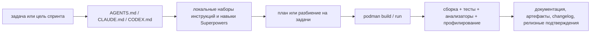

# Инструменты и агентный рабочий процесс

## Область действия

Этот документ фиксирует стабильный рабочий процесс разработки `iojournal`:

- обязательную контейнерную модель выполнения
- базовый набор инструментов Clang 22 для анализа и отладки
- базовый набор инструментов профилирования и анализа производительности
- точки входа для методики контрольных замеров и процесса анализа профилировщиками
- правила использования локальных наборов инструкций
- границы ответственности между `AGENTS.md`, `CLAUDE.md`, `CODEX.md` и локальными наборами инструкций репозитория

Документ является авторитативным для рабочего процесса и набора инструментов. Он не заменяет
планы по конкретным функциям из `docs/plans/`.

## Модель выполнения

- Разработка и проверка выполняются внутри Podman-образа из `deploy/podman/Containerfile`.
- Контейнер считается основной средой для сборки, анализа, контрольных замеров и релизных проверок.
- Утилиты хоста используются только как средства оркестрации.
- Процедуры контрольных замеров и профилирования должны воспроизводиться из скриптов репозитория или явно задокументированных команд.
- Обычный запуск Podman используется для стандартных задач сборки, тестирования и анализа.
- `scripts/podman_perf_lane.py` является официальным режимом запуска Podman для `io_uring`,
  `uftrace`, `gdb` и других профилировочных задач, чувствительных к ограничениям `ptrace`.

## Обязательный базовый набор сборки и анализа

| Область | Обязательный набор |
|---|---|
| Контейнерное исполнение | `podman` |
| Система сборки | `cmake`, `ctest`, `CMakePresets.json` |
| Форматирование | `clang-format` |
| Статический анализ | `cppcheck`, `PVS-Studio`, `CodeChecker` |
| Анализ Clang | `clang-tidy`, `clang` Static Analyzer |
| Проверка документации | `python3 scripts/lint-docs.py` |
| Набор benchmark-сценариев | `uv run --script scripts/benchmarks.py` |
| Точка входа в профилирование | `bash scripts/run-profiler-review.sh` |
| Выделенный Podman perf-режим | `uv run --script scripts/podman_perf_lane.py ...` |
| Сборка режима для `uftrace` | `uv run --script scripts/build_uftrace_bench.py` |
| Репозиторная проверка | `python scripts/quality.py` |

## Базовый набор инструментов Clang 22

В рамках hardening и программы анализа производительности репозиторий должен использовать следующие
инструменты и возможности Clang 22.

| Инструмент или возможность | Назначение | Ожидаемое применение |
|---|---|---|
| `clang-tidy` | lint и анализ по набору правил | обязателен через `CodeChecker` и через отдельные целевые прогоны |
| `run-clang-tidy.py` | пакетный запуск `clang-tidy` из `compile_commands.json` | использовать для широких локальных прогонов и кода benchmark-набора |
| `clang-tidy-diff.py` | проверка `clang-tidy` только по diff | использовать для фокусного review инкрементальных патчей |
| `clang` Static Analyzer | path-sensitive поиск ошибок | обязателен через `CodeChecker`, опционально через `scan-build` |
| `scan-build` | локальная обертка analyzer над сборкой | использовать для HTML-разбора и ad hoc локального анализа |
| `scan-view` | просмотр отчетов `scan-build` в браузере | использовать, когда нужен локальный HTML-разбор |
| `clang-check` | быстрые sanity-check для translation unit | использовать для точечной front-end проверки одного TU |
| `diagtool` | исследование diagnostic groups и warning policy | использовать при ужесточении warning policy и разборе диагностик |
| `-ftime-trace` | трассировка времени компиляции и анализа | обязательная опция для расследования compiler-time и analyzer-time |
| `-fproc-stat-report` | отчет о времени и памяти процесса | использовать для измерения стоимости сборки и анализа в методических документах |
| source-based coverage | точные артефакты покрытия Clang | использовать для verification и release evidence, когда требуется coverage |

## Базовый набор инструментов GCC 15

Репозиторий должен также иметь отдельный GCC-режим для перекрестной проверки результатов анализа и профилирования.

| Инструмент или возможность | Назначение | Ожидаемое применение |
|---|---|---|
| `-fanalyzer` | path-sensitive static analysis в GCC | запускать как отдельный analysis lane рядом с Clang tools |
| `-fanalyzer-checker=` | точечные GCC analyzer checkers | использовать для focused triage и reduced-noise repro runs |
| `-Wanalyzer-too-complex` | видимость ограничений analyzer | держать включенным, чтобы видеть потерю analyzer coverage |
| `--param analyzer-*` | настройка analyzer | использовать для больших translation unit и кода benchmark-набора |
| `gcov` | сбор raw coverage в GCC lane | использовать как базовый источник coverage |
| `gcovr` | генерация coverage-отчетов и export для CI | использовать для HTML, SonarQube, Cobertura и summary outputs |
| `gcov-tool` | offline-обработка profile и coverage data | использовать для merge и normalization workflows |
| `gcov-dump` | низкоуровневая инспекция `.gcda` / `.gcno` | использовать для debugging coverage и profile artifacts |
| `lto-dump` | разбор LTO-объектов | использовать, когда LTO или optimizer evidence входит в perf review |
| `-fprofile-generate` / `-fprofile-use` | PGO-эксперименты | использовать для capability studies и post-baseline optimization work |
| `-Q --help=optimizers` | инспекция реального набора optimizer flags | использовать для воспроизводимой фиксации methodology |
| `-fprofile-report` | profile diagnostics | использовать при документировании profile-use behavior |

Правила:

- GCC lane не заменяет Clang lane.
- Инструменты GCC рассматриваются как второй источник подтверждений для корректности, покрытия и анализа оптимизаций.
- При использовании GCC lane `gcovr` считается предпочтительным reporting layer для coverage.

## Правила совместимости компиляторов и векторизации

- Для compiler-sensitive задач в `iojournal` держите активными и Clang lane, и GCC lane.
  Измеряемые и публикуемые режимы должны использовать явный `-std=c23`; дефолтный `gnu23` в GCC
  не считается контрактом репозитория.
- Не смешивайте sanitizer-объекты, LTO-объекты и function-multi-versioned resolver'ы GCC и Clang
  в одном бинарнике, одном наборе benchmark-артефактов или одном release verification pack.
- Для изменений, затрагивающих hot-path циклы, SIMD или dispatch, снимайте диагностические отчеты
  о векторизации от обоих компиляторов:
  - Clang: `-Rpass=loop-vectorize -Rpass-missed=loop-vectorize -Rpass-analysis=loop-vectorize`
  - GCC: `-fopt-info-vec-all`
- В качестве переносимой подсказки для векторизации предпочитайте `#pragma omp simd`.
  Компилятор-специфичные pragmas допускаются только во внутренних kernel'ах, при наличии scalar
  fallback и измеримого обоснования.
- Добавляйте `restrict` только тогда, когда контракт отсутствия aliasing явно следует из API или
  внутренних правил владения и подкреплен тестами либо инвариантами.
- `-ffast-math` должен оставаться выключенным в репозиторном baseline. Если измеренный kernel
  требует локального FP contraction, ограничивайте его по области действия и фиксируйте причину в
  evidence docs.
- При повторном открытии `arm64` SIMD-работ сохраняйте отдельный Clang lane, потому что качество
  кодогенерации для `NEON` и будущих SVE-family расширений не обязано совпадать между GCC и Clang.

## Инструменты анализа производительности и отладки

Эти инструменты входят в ожидаемый стек для анализа производительности и исследования benchmark-результатов.

| Инструмент | Назначение |
|---|---|
| `hyperfine` | воспроизводимые измерения времени и сравнения на уровне команд |
| `uftrace` | трассировка hot-path и разбор стоимости функций |
| `valgrind --tool=callgrind` | разбор стоимости вызовов и instruction path |
| `gdb` | низкоуровневая отладка и расследование сбоев |
| `gcovr` | coverage reporting для benchmark и verification lanes |
| пресет `clang-perf` | release-facing базовый режим для локальных benchmark и callgrind |
| пресет `clang-uftrace` | lane с `-pg` для `uftrace` и parity профилировщика |
| пресеты `clang-asan` / `clang-tsan` | supporting evidence для safety и concurrency |
| lane с `gcc -fanalyzer` | cross-tool evidence для статического анализа |

Правила:

- Профилировщик не заменяет проверки корректности.
- Утверждения о производительности нельзя публиковать без methodology и raw artifacts.
- Сравнение библиотек на ненормализованных сценариях должно явно помечаться как capability-specific.

## Контрольные замеры и точки входа в профилирование

Используйте эти документы и скрипты как стабильную поверхность для набора подтверждающих материалов спринтов 09 и 10:

| Поверхность | Роль |
|---|---|
| `docs/testing/BENCHMARK_METHODOLOGY.md` | каталог нормализованных сценариев, политика артефактов и правила сравнения |
| `docs/testing/PROFILER_WORKFLOW.md` | выбор инструментов профилирования, политика артефактов и правила разбора результатов |
| `scripts/podman_perf_lane.py` | официальный режим запуска Podman для `io_uring` и профилирования, чувствительного к `ptrace` |
| `scripts/benchmarks.py` | сборка и запуск benchmark-binaries репозитория с выгрузкой raw TSV artifacts |
| `scripts/build_uftrace_bench.py` | сборка выделенных benchmark-binaries для `clang-uftrace` |
| `scripts/run-profiler-review.sh` | запуск одного режима профилирования против одного benchmark-binary и scenario |

Правила:

- `docs/testing/BENCHMARK_METHODOLOGY.md` является источником истины для идентификаторов сценариев и границы между shared и capability-specific режимами.
- `docs/testing/PROFILER_WORKFLOW.md` является источником истины для требований к подтверждениям, подкрепленным профилировщиками.
- Скрипты репозитория должны синхронизироваться с обоими документами при изменении benchmark-сценариев или режимов профилирования.
- Для release-facing локальных сравнений используйте `clang-perf`, а для `uftrace` evidence используйте `clang-uftrace`.
- Используйте `scripts/podman_perf_lane.py`, когда задача по benchmark или профилированию зависит от
  доступности `io_uring` или ослабленных ограничений `ptrace`; не расширяйте обычный Podman lane.

## Наборы инструкций и агенты

### Локальные наборы инструкций репозитория

Локальные наборы инструкций в `.claude/skills/` выступают как локальная память проекта для повторяемых решений:

- `iojournal-architecture`
- `iojournal-coding-standards`
- `iojournal-repository-conventions`
- `logging-rfc-reference`
- `modern-c23`

Правила:

- Используйте локальные наборы инструкций репозитория до того, как придумывать новые архитектурные или стилевые правила.
- Содержимое этих наборов инструкций считается повторно используемым кэшем решений, а не необязательной подсказкой.
- Локальные наборы инструкций должны быть синхронизированы со стабильной документацией и корневыми instruction files.

### Superpowers и workflow skills

Используйте соответствующий workflow skill, когда задача этого требует:

- brainstorming перед новым feature или проектированием workflow
- writing-plans при расширении multi-step работы
- test-driven-development перед реализацией
- subagent-driven-development, когда задачи можно безопасно разбить
- verification-before-completion перед заявлением об успешном результате

### Агенты

Агенты являются вспомогательными исполнителями, а не источниками правил.

Правила:

- Subagents могут исследовать, реализовывать, ревьюить или суммировать изолированные задачи.
- Subagents обязаны следовать тем же правилам репозитория, что и основной агент.
- Политика по-прежнему задается `AGENTS.md`, `CLAUDE.md`, `CODEX.md`, стабильной документацией и локальными наборами инструкций.
- Результат subagent становится evidence только после review и интеграции основным агентом.

## Роли корневых instruction files

| Файл | Роль |
|---|---|
| `AGENTS.md` | общий рабочий контракт репозитория для структуры, инструментов, стиля docs, тестирования и рабочего процесса |
| `CLAUDE.md` | project instructions для Claude и зоны внимания |
| `CODEX.md` | project instructions для Codex и рабочие правила |
| `.claude/skills/*` | локальная повторно используемая память решений и workflow |

Правила интерпретации:

- `AGENTS.md` задает общую поверхность правил репозитория.
- `CLAUDE.md` и `CODEX.md` уточняют поведение конкретных агентов, не переопределяя факты репозитория.
- Stable docs в `docs/en/` важнее scratch notes из `docs/tmp/`.
- Планы из `docs/plans/` определяют sequencing поставки, а не общий coding policy репозитория.

## Операционные правила

- При изменении правил рабочего процесса синхронизируйте `AGENTS.md`, `CLAUDE.md`, `CODEX.md` и локальные наборы инструкций.
- Добавляйте новые инструменты в контейнерный образ до того, как делать их обязательными в планах.
- Внешне заметные изменения инструментов фиксируйте в `CHANGELOG.md`.
- Процедуры контрольных замеров, анализаторов и профилировщиков должны запускаться из корня репозитория.

## Нецели

- Нет проверки только на хосте без контейнера.
- Нет утверждений только на основе профилировщика в release materials без документированной методологии.
- Нет независимых правил в skills или agents, противоречащих корневым инструкциям репозитория.
