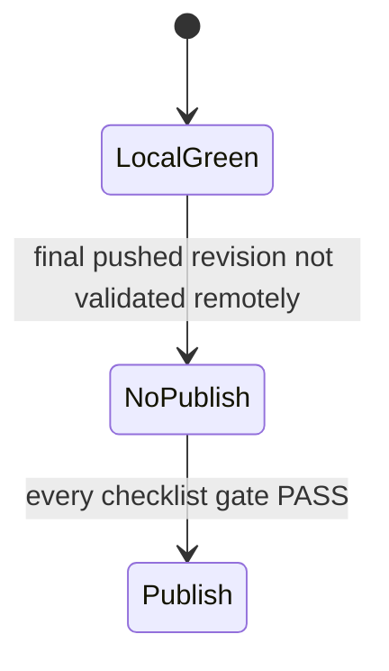

# Решение О Публикации RC1

## Решение

| Поле | Значение |
| --- | --- |
| Цель | `v0.1.0-rc.1` |
| Решение | `NO-PUBLISH` |
| Дата решения | `2026-03-17` |
| Основание решения | Sprint 11D завершен и все локальные gate зеленые, но финальный remote gate все еще не закрыт |

## Текущая Доказательная База

| Gate | Текущее доказательство | Статус |
| --- | --- | --- |
| Local quality | `python3 scripts/lint-docs.py` `PASS`; `bash scripts/quality.sh` `PASS: 14`, `FAIL: 0`, `SKIP: 0` | `PASS` |
| Functional comparison | пакет Sprint 10 complete в [`docs/plans/comparison/`](/opt/projects/repositories/iojournal/docs/plans/comparison/) | `PASS` |
| Optimization evidence | активный benchmark [`20260316-210134`](/opt/projects/repositories/iojournal/docs/tmp/benchmarks/20260316-210134), активный profiler pack [`20260316-210204`](/opt/projects/repositories/iojournal/docs/tmp/profiling/20260316-210204), активные `uftrace` companions [`20260316-210329`](/opt/projects/repositories/iojournal/docs/tmp/profiling/20260316-210329), [`20260316-210345`](/opt/projects/repositories/iojournal/docs/tmp/profiling/20260316-210345), [`20260316-210349`](/opt/projects/repositories/iojournal/docs/tmp/profiling/20260316-210349) | `PASS` |
| Release candidate run | активный локальный RC run [`20260316T212052Z-d52d88e`](/opt/projects/repositories/iojournal/dist/release-candidate/runs/20260316T212052Z-d52d88e/summary.md) из post-11D workspace state | `PASS` |
| Release assets | существуют `dist/iojournal-v0.1.0-rc.1.tar.gz`, `dist/iojournal-v0.1.0-rc.1-verification.tar.gz`, `dist/iojournal-v0.1.0-rc.1.sha256` и `dist/RELEASE_NOTES.md` для post-11D workspace state | `PASS` |
| Repository ownership | [`.github/CODEOWNERS`](/opt/projects/repositories/iojournal/.github/CODEOWNERS) теперь назначает репозиторий на `@ioplane/developers` | `PASS` |
| Structural optimization gate | Sprint 11D завершен; optimization evidence обновлен | `PASS` |
| Final remote gate | финальное состояние workspace еще не закоммичено и не запушено; текущие GitHub runs не представляют финальное локальное состояние | `FAIL` |

## Текущий Remote Сигнал

- Последние видимые GitHub Actions runs все еще привязаны к commit `d52d88e`.
- Эти runs не являются authoritative для текущего локального состояния workspace.
- Текущий локальный release-candidate run и release assets были собраны до появления Sprint 11D, поэтому требуют пересборки из финального post-11D workspace state.
- Видимая remote-история уже содержит non-green runs для `Release Gate`, `codeql` и `sonarcloud`, поэтому remote-публикация недопустима без fresh pushed revision и нового workflow pass.

## Необходимые Действия До Публикации

1. Повторно выполнить `bash scripts/run-release-candidate.sh` и обновить `dist/release-candidate` из финального post-11D state.
2. Повторно выполнить `bash scripts/build-release-assets.sh v0.1.0-rc.1` и `bash scripts/render-release-notes.sh`.
3. Закоммитить и запушить финальное состояние workspace.
4. Дождаться обязательных GitHub workflow run’ов на pushed revision и зафиксировать их результат.
5. Обновить этот документ до `PUBLISH` только после того, как каждый gate из [`05-release-candidate-checklist.md`](/opt/projects/repositories/iojournal/docs/ru/05-release-candidate-checklist.md) будет иметь статус `PASS`.
