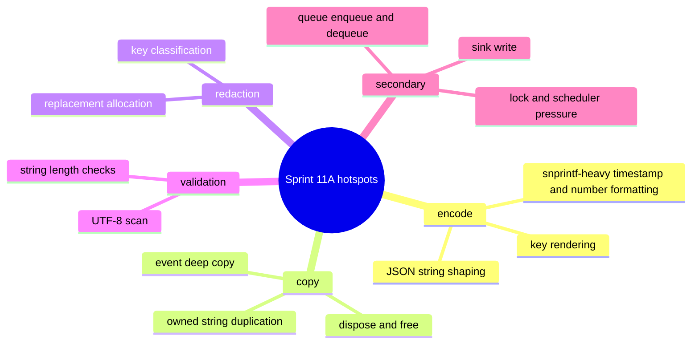

# Performance Hotspot Inventory For Sprint 11A

## Scope

- Freeze the current hotspot inventory before `io_uring` and SIMD relevance work.
- Anchor Sprint 11A optimization decisions to the fresh Task 3 artifact set.
- Distinguish dominant CPU-cost hotspots from secondary queue and sink-write costs.
- Treat this document as a historical Sprint 11A snapshot. The active release-facing source of record moved to the refreshed Sprint 11B profiler pack in `docs/plans/comparison/PERFORMANCE_RESULTS.md`.

## Active Artifact Set

| Artifact class | Run ID | Role |
| --- | --- | --- |
| local benchmark baseline | [`20260316-140816`](/opt/projects/repositories/iojournal/docs/tmp/benchmarks/20260316-140816) | current Sprint 11A local source of record |
| callgrind and repeatability pack | [`20260316-140903`](/opt/projects/repositories/iojournal/docs/tmp/profiling/20260316-140903) | current Task 3 instruction-cost and repeatability source |
| `uftrace` metadata row | [`20260316-140954`](/opt/projects/repositories/iojournal/docs/tmp/profiling/20260316-140954) | wall-time call graph for `medium_message_with_metadata` |
| `uftrace` contention row | [`20260316-141102`](/opt/projects/repositories/iojournal/docs/tmp/profiling/20260316-141102) | wall-time call graph for `contention_mpsc` |
| `uftrace` file row | [`20260316-141113`](/opt/projects/repositories/iojournal/docs/tmp/profiling/20260316-141113) | wall-time call graph for `append_ndjson` |

## Benchmark Baseline Snapshot

| Scenario | Iterations | ns/op | Artifact |
| --- | --- | --- | --- |
| `disabled_level` | `50000` | `9.55` | [`bench_hot_path.tsv`](/opt/projects/repositories/iojournal/docs/tmp/benchmarks/20260316-140816/bench_hot_path.tsv) |
| `enabled_console` | `50000` | `1949.15` | [`bench_hot_path.tsv`](/opt/projects/repositories/iojournal/docs/tmp/benchmarks/20260316-140816/bench_hot_path.tsv) |
| `medium_message` | `50000` | `1474.25` | [`bench_hot_path.tsv`](/opt/projects/repositories/iojournal/docs/tmp/benchmarks/20260316-140816/bench_hot_path.tsv) |
| `medium_message_with_metadata` | `50000` | `2629.78` | [`bench_hot_path.tsv`](/opt/projects/repositories/iojournal/docs/tmp/benchmarks/20260316-140816/bench_hot_path.tsv) |
| `contention_mpsc` | `50000` | `1993.08` | [`bench_hot_path.tsv`](/opt/projects/repositories/iojournal/docs/tmp/benchmarks/20260316-140816/bench_hot_path.tsv) |
| `append_file` | `50000` | `1587.51` | [`bench_file_sink.tsv`](/opt/projects/repositories/iojournal/docs/tmp/benchmarks/20260316-140816/bench_file_sink.tsv) |

## Encode-Time Hotspots

### `enabled_console`

Sources:
- [`callgrind-bench_hot_path-enabled_console.summary.txt`](/opt/projects/repositories/iojournal/docs/tmp/profiling/20260316-140903/callgrind-bench_hot_path-enabled_console.summary.txt)

Observed costs:
- `ij_json_console_encode`: `55.05%`
- `ij_builder_append_json_string`: `30.75%`
- `ij_builder_append_json_key`: `10.89%`
- `__snprintf_chk` plus `__vsnprintf_internal`: about `37%` combined instruction share inside the formatting stack

Interpretation:
- JSON shaping is the primary CPU consumer even on the plain enabled console path.
- The encode stack is formatting-heavy before it becomes syscall-heavy.

### `medium_message_with_metadata`

Sources:
- [`callgrind-bench_hot_path-medium_message_with_metadata.summary.txt`](/opt/projects/repositories/iojournal/docs/tmp/profiling/20260316-140903/callgrind-bench_hot_path-medium_message_with_metadata.summary.txt)
- [`uftrace-bench_hot_path-medium_message_with_metadata.report.txt`](/opt/projects/repositories/iojournal/docs/tmp/profiling/20260316-140954/uftrace-bench_hot_path-medium_message_with_metadata.report.txt)

Observed costs:
- `ij_json_console_encode`: `53.96%`
- `ij_builder_append_json_string`: `32.82%`
- `ij_logger_log`: `69.026 ms`
- `ij_json_console_encode`: `7.598 ms`

Interpretation:
- Metadata-heavy rows remain encode-dominated.
- Optimization candidates must target JSON escape and field shaping before sink-write changes.

## Redaction Hotspots

Sources:
- [`callgrind-bench_hot_path-medium_message_with_metadata.summary.txt`](/opt/projects/repositories/iojournal/docs/tmp/profiling/20260316-140903/callgrind-bench_hot_path-medium_message_with_metadata.summary.txt)
- [`callgrind-bench_hot_path-contention_mpsc.summary.txt`](/opt/projects/repositories/iojournal/docs/tmp/profiling/20260316-140903/callgrind-bench_hot_path-contention_mpsc.summary.txt)
- [`callgrind-bench_file_sink-append_ndjson.summary.txt`](/opt/projects/repositories/iojournal/docs/tmp/profiling/20260316-140903/callgrind-bench_file_sink-append_ndjson.summary.txt)

Observed costs:
- `medium_message_with_metadata`:
  - `ij_redact_owned_attr_value`: `18.46%`
  - `ij_key_should_redact`: `18.30%`
  - `uftrace` wall time: `37.950 ms` and `37.554 ms`
- `contention_mpsc`:
  - `ij_redact_owned_attr_value`: `18.23%`
  - `ij_key_should_redact`: `18.07%`
  - `uftrace` wall time: `53.661 ms` and `53.152 ms`
- `append_file`:
  - `ij_redact_owned_attr_value`: `14.40%`
  - `ij_key_should_redact`: `13.39%`
  - `uftrace` wall time: `24.171 ms` and `23.262 ms`

Interpretation:
- Key classification is a first-order hotspot, not a minor helper.
- Redaction matching is a valid SIMD and table-driven candidate because it is repeated across all hot shared rows.

## Event-Copy Hotspots

Sources:
- [`callgrind-bench_hot_path-enabled_console.summary.txt`](/opt/projects/repositories/iojournal/docs/tmp/profiling/20260316-140903/callgrind-bench_hot_path-enabled_console.summary.txt)
- [`callgrind-bench_hot_path-medium_message_with_metadata.summary.txt`](/opt/projects/repositories/iojournal/docs/tmp/profiling/20260316-140903/callgrind-bench_hot_path-medium_message_with_metadata.summary.txt)
- [`callgrind-bench_hot_path-contention_mpsc.summary.txt`](/opt/projects/repositories/iojournal/docs/tmp/profiling/20260316-140903/callgrind-bench_hot_path-contention_mpsc.summary.txt)
- [`callgrind-bench_file_sink-append_ndjson.summary.txt`](/opt/projects/repositories/iojournal/docs/tmp/profiling/20260316-140903/callgrind-bench_file_sink-append_ndjson.summary.txt)

Observed costs:
- `enabled_console`: `ij_event_copy_from_input` `33.45%`
- `medium_message_with_metadata`: `ij_event_copy_from_input` `36.06%`, `ij_event_copy_dispose` `4.67%`
- `contention_mpsc`: `ij_event_copy_from_input` `35.86%`, `ij_event_copy_dispose` `5.08%`
- `append_file`: `ij_event_copy_from_input` `33.44%`, `ij_event_copy_dispose` `5.50%`

Wall-time confirmation:
- `medium_message_with_metadata`: `ij_event_copy_from_input` `52.823 ms`
- `contention_mpsc`: `ij_event_copy_from_input` `74.794 ms`
- `append_file`: `ij_event_copy_from_input` `38.545 ms`

Interpretation:
- Deep copy remains a co-dominant hotspot with encode and redaction.
- The current synchronous path is spending more time shaping payload state than flushing payload bytes.

## Queue And Lock Hotspots

Sources:
- [`callgrind-bench_hot_path-contention_mpsc.summary.txt`](/opt/projects/repositories/iojournal/docs/tmp/profiling/20260316-140903/callgrind-bench_hot_path-contention_mpsc.summary.txt)
- [`uftrace-bench_hot_path-contention_mpsc.report.txt`](/opt/projects/repositories/iojournal/docs/tmp/profiling/20260316-141102/uftrace-bench_hot_path-contention_mpsc.report.txt)
- [`callgrind-bench_file_sink-append_ndjson.summary.txt`](/opt/projects/repositories/iojournal/docs/tmp/profiling/20260316-140903/callgrind-bench_file_sink-append_ndjson.summary.txt)

Observed costs:
- `contention_mpsc`:
  - `ij_ring_enqueue`: `1.01%`
  - `uftrace` `ij_ring_enqueue`: `3.215 ms`
  - `uftrace` `ij_ring_try_dequeue`: `2.095 ms`
  - `uftrace` `mtx_lock`: `1.785 ms`
  - `uftrace` `mtx_unlock`: `789 us`
  - `linux:schedule`: `31.504 ms`
- `append_file`:
  - `ij_ring_enqueue`: `1.14%`
  - `ij_ring_try_dequeue`: `1.09%`

Interpretation:
- The queue is not the dominant instruction hotspot in the current shared scenarios.
- Contention cost exists, but the queue and lock surface remains secondary to copy, redaction, and encode work.
- `io_uring` or queue redesign must clear a high relevance bar because the current evidence does not point to sink-submit or ring primitives as the main bottleneck.

## Sink-Write Hotspots

Sources:
- [`callgrind-bench_hot_path-enabled_console.summary.txt`](/opt/projects/repositories/iojournal/docs/tmp/profiling/20260316-140903/callgrind-bench_hot_path-enabled_console.summary.txt)
- [`callgrind-bench_hot_path-medium_message_with_metadata.summary.txt`](/opt/projects/repositories/iojournal/docs/tmp/profiling/20260316-140903/callgrind-bench_hot_path-medium_message_with_metadata.summary.txt)
- [`callgrind-bench_file_sink-append_ndjson.summary.txt`](/opt/projects/repositories/iojournal/docs/tmp/profiling/20260316-140903/callgrind-bench_file_sink-append_ndjson.summary.txt)
- [`uftrace-bench_file_sink-append_ndjson.report.txt`](/opt/projects/repositories/iojournal/docs/tmp/profiling/20260316-141113/uftrace-bench_file_sink-append_ndjson.report.txt)

Observed costs:
- `enabled_console`: `ij_console_sink_write` `2.43%`
- `medium_message_with_metadata`: `ij_console_sink_write` `2.31%`, `uftrace` `2.453 ms`
- `append_file`: `ij_file_sink_write` `1.55%`, `uftrace` `1.726 ms`

Interpretation:
- Current shared rows are not sink-write dominated.
- File and console writes are measurable, but they are not the primary optimization frontier in the current RC code base.

## Optimization Order

| Priority | Area | Reason |
| --- | --- | --- |
| `P1` | event copy | one-third of instruction cost across all shared rows |
| `P1` | redaction key matching | double-digit instruction cost and high repeated wall time |
| `P1` | JSON escape and field shaping | dominant encode-time stack in every emitting scenario |
| `P2` | UTF-8 validation and string-length scans | visible validation overhead and SIMD candidate |
| `P3` | queue and lock tuning | secondary cost center under the current contention fixture |
| `P3` | sink-write backend changes | not currently the leading hotspot; `io_uring` needs explicit relevance proof |

## Conclusion

- The current RC implementation remains dominated by event copy, redaction, JSON shaping, and validation.
- Queue primitives and sink writes are secondary costs in the measured shared scenarios.
- Sprint 11A should treat `io_uring` as a relevance question first and a code path second.
- Sprint 11A should treat SIMD as most plausible for redaction matching, JSON escape scanning, and UTF-8 validation rather than for queue logic or sink dispatch.
