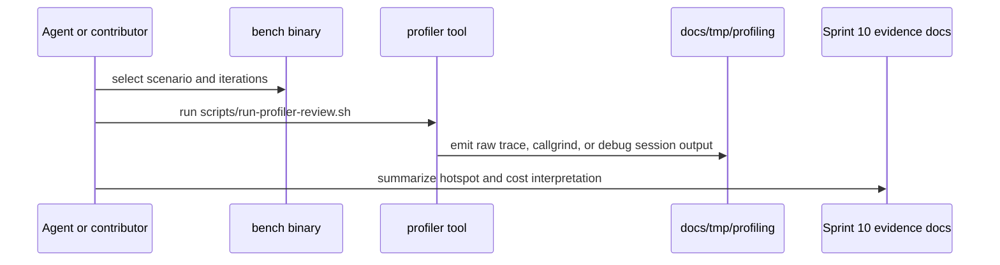

# Profiler Workflow For v0.1.0-rc.1

[](https://github.com/namhyung/uftrace)
[](https://valgrind.org/docs/manual/cl-manual.html)
[](https://www.sourceware.org/gdb/)
[](https://mermaid.js.org/syntax/sequenceDiagram.html)

## Scope

- Define the profiler entrypoints for Sprint 09 through Sprint 11.
- Map repository scripts to the intended diagnostic question.
- Freeze artifact locations and review expectations for profiler-backed evidence.
- Freeze the dedicated Podman perf lane for `io_uring` and ptrace-sensitive profiler runs.
- Freeze the profiler evidence rules required by `PERF_OPTIMIZATION_GATE.md`.



## Tool Selection Matrix

| Tool | Primary question | Entry mode |
| --- | --- | --- |
| `hyperfine` | repeated command-level timing stability | `scripts/run-profiler-review.sh hyperfine ...` |
| `uftrace` | function graph and hot-path cost distribution | `scripts/run-profiler-review.sh uftrace ...` |
| `valgrind --tool=callgrind` | call-cost and instruction-path explanation | `scripts/run-profiler-review.sh callgrind ...` |
| `gdb` | low-level runtime inspection and failure triage | `scripts/run-profiler-review.sh gdb ...` |

Rules:

- Use `hyperfine` for repetition and drift, not for call attribution.
- Use `uftrace` when a runtime call graph is required.
- Use `callgrind` when relative call cost matters more than wall-clock time.
- Use `gdb` for stepwise inspection and failure analysis, not for publication metrics.

## Canonical Commands

Prepare the benchmark binaries first:

```bash
PRESET=clang-perf bash scripts/run-benchmarks.sh
uv run --script scripts/build_uftrace_bench.py
```

Then select one profiler mode:

```bash
bash scripts/run-profiler-review.sh auto 3000
bash scripts/run-profiler-review.sh uftrace bench_hot_path 2000 medium_message_with_metadata
bash scripts/run-profiler-review.sh callgrind bench_file_sink 3000 append_ndjson
bash scripts/run-profiler-review.sh gdb bench_syslog_udp 1000 udp_loopback
```

Use the dedicated Podman perf lane for host-launched `io_uring`, `uftrace`, `gdb`, and other
ptrace-sensitive runs:

```bash
uv run --script scripts/podman_perf_lane.py bash
uv run --script scripts/podman_perf_lane.py bash scripts/run-profiler-review.sh auto 3000
uv run --script scripts/podman_perf_lane.py bash scripts/run-profiler-review.sh uftrace bench_hot_path 2000 medium_message_with_metadata
```

The current script supports these benchmark names:

- `bench_hot_path`
- `bench_file_sink`
- `bench_syslog_udp`

Profiler preset rules:

- `scripts/run-profiler-review.sh` defaults to `PRESET=clang-perf`.
- `uftrace` runs use `UFTRACE_PRESET=clang-uftrace` unless overridden explicitly.
- Keep `clang-debug` for bring-up and debugger convenience, not for release-facing comparison evidence.
- `auto` mode always runs the canonical shared suite and records whether the invocation was inside
  the dedicated Podman perf lane.
- `scripts/podman_perf_lane.py` is the official Podman launch mode for `io_uring` and
  ptrace-sensitive profiling because the default seccomp profile does not expose that path
  correctly for Sprint 11A relevance work.

## Artifact Policy

- Store profiler artifacts under `docs/tmp/profiling/`.
- Keep one artifact family per benchmark target and tool.
- Do not overwrite Sprint 10 evidence directories without recording a new run identifier or updated timestamp in the summary docs.
- Treat missing profiler tooling in the Podman image as a container provisioning defect, not as acceptable release evidence.
- Treat `io_uring` failures under the default Podman seccomp profile as launch-mode defects, not
  as valid negative evidence; use the dedicated perf lane first.

## Review Rules

- Every published performance conclusion must name the raw profiler artifact that supports it.
- Shared-scenario conclusions must be tied back to the scenario IDs in `docs/testing/BENCHMARK_METHODOLOGY.md`.
- If a hotspot is dominated by sink I/O, state that explicitly instead of claiming a library-wide CPU regression.
- If a profiler run uses a capability-specific scenario, keep its conclusion out of the shared-score table.
- Every optimization change in Sprint 11A must cite one benchmark row and one profiler artifact.
- Every optimization change in Sprint 11A must confirm that the scalar path remains valid.

## Exit Criteria

- Sprint 09 requires only the scripted profiler entrypoints, artifact policy, and review rules.
- Sprint 10 requires profiler-backed explanations for `enabled_console`, `medium_message_with_metadata`, `contention_mpsc`, and the normalized file-append slice.
- Sprint 10 also requires toolchain parity in the Podman image: `uftrace`, `hyperfine`, `diagtool`, `frun`, `fresolve`, and the dedicated `clang-uftrace` build lane.
- Capability-specific `udp_loopback` profiler runs are optional for Sprint 09 and required only when Sprint 10 uses syslog results in the comparison appendix.
- The current Podman image satisfies the Sprint 10 toolchain parity requirement.
- Sprint 11A requires one official Podman perf lane command surface for `io_uring` and
  ptrace-sensitive profiler work.

## Non-Goals

- No attempt to replace unit tests or analyzers with profiler runs.
- No publication of `gdb` sessions as performance evidence.
- No unexplained wall-clock claims without a matching benchmark artifact.
